# 极简网页笔记 + 轻量化日复盘项目开发流程图

## 一、整体流程概览

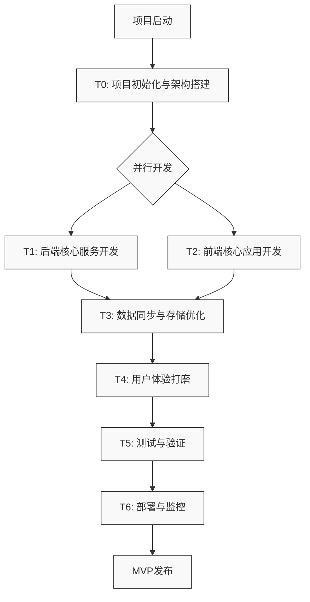

## 二、详细子项目流程图

### T0: 项目初始化与架构搭建

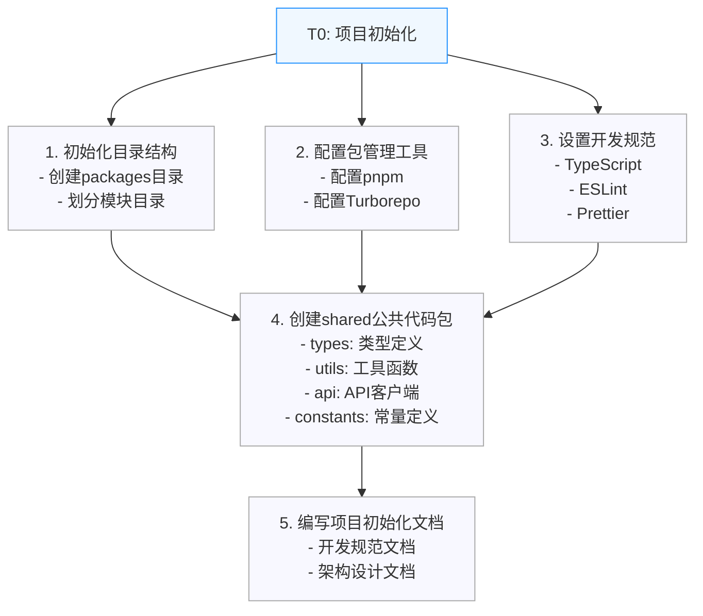

### T1: 后端核心服务开发

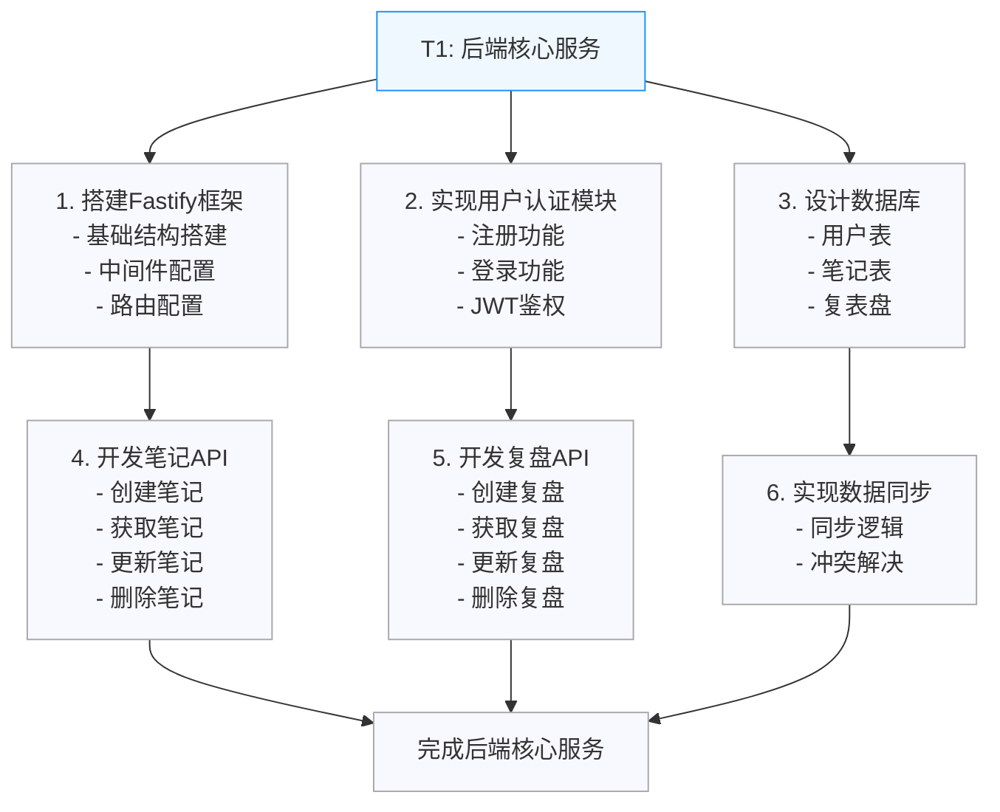

### T2: 前端核心应用开发

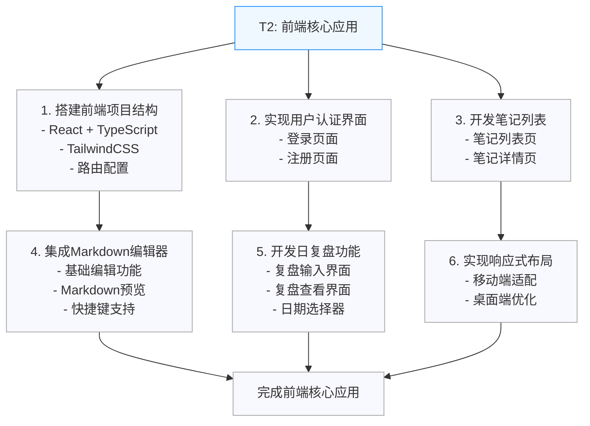

### T3: 数据同步与存储优化

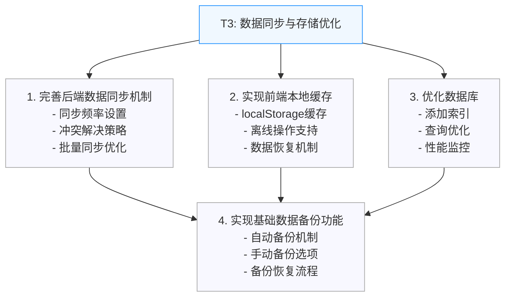

### T4: 用户体验打磨

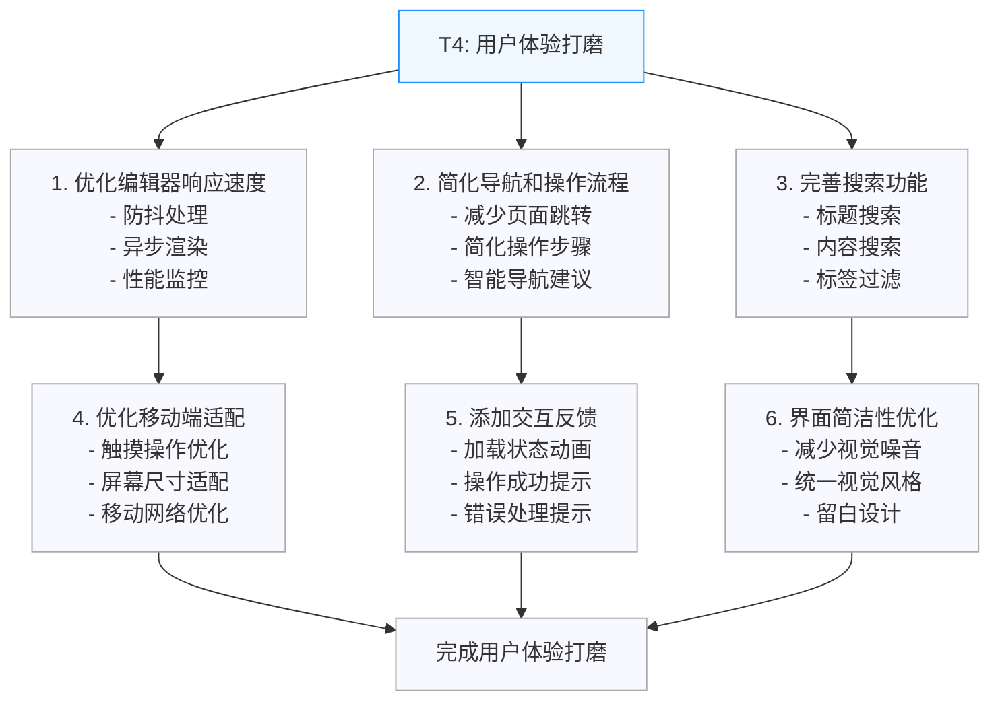

### T5: 测试与验证

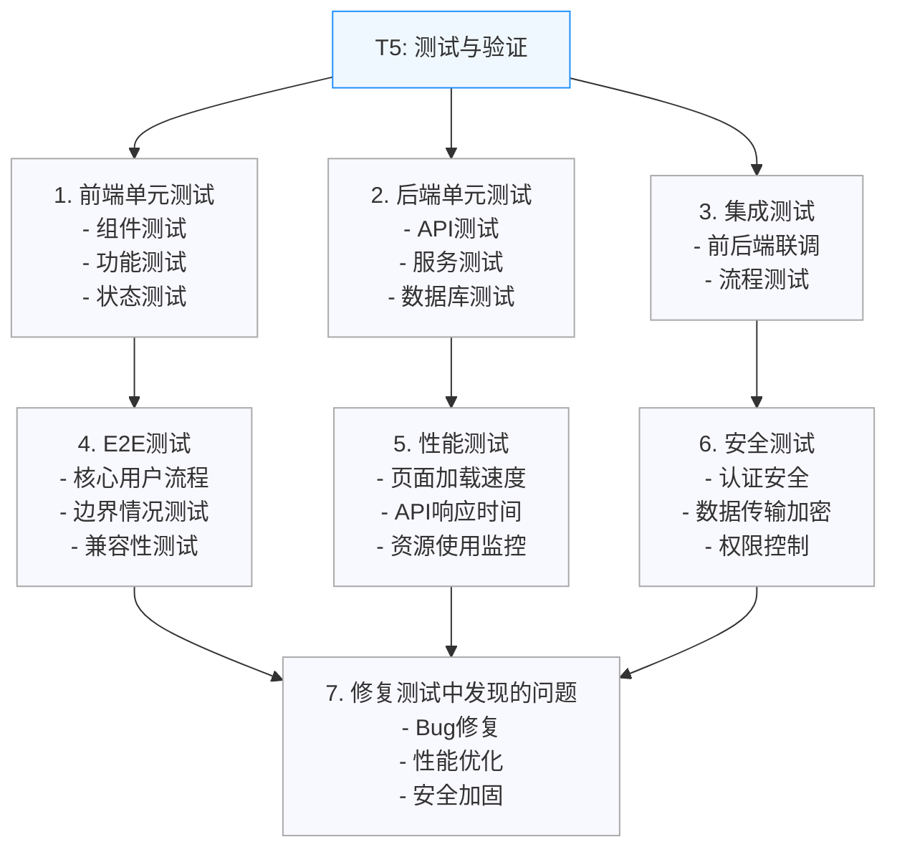

### T6: 部署与监控

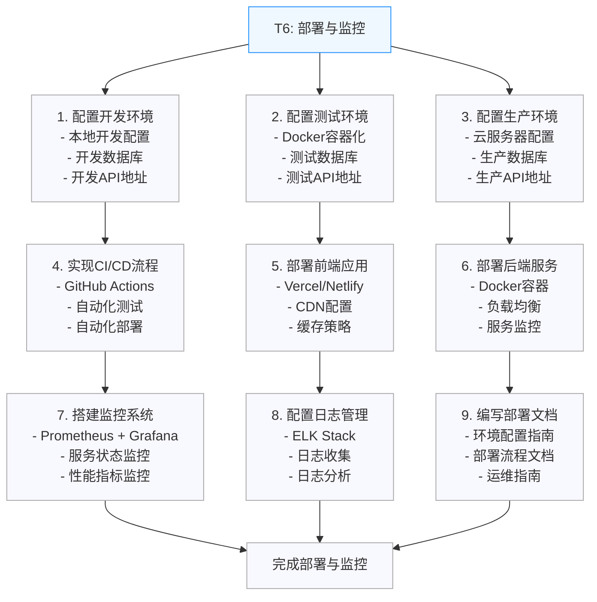

## 二、项目时间线

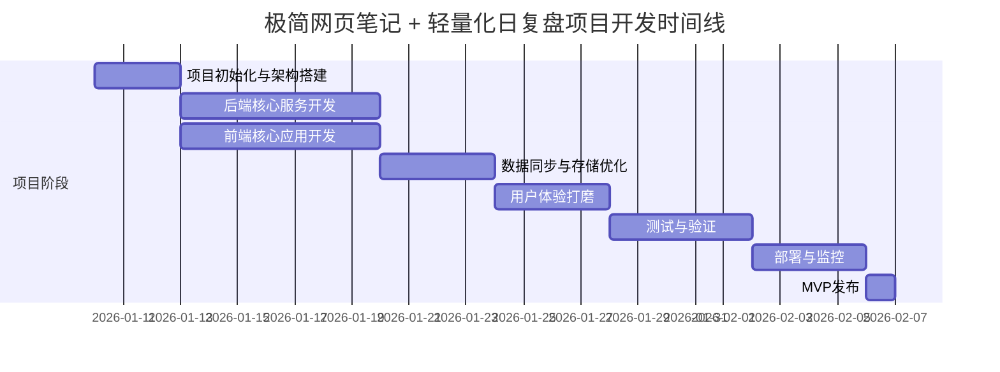

## 三、并行任务关系图

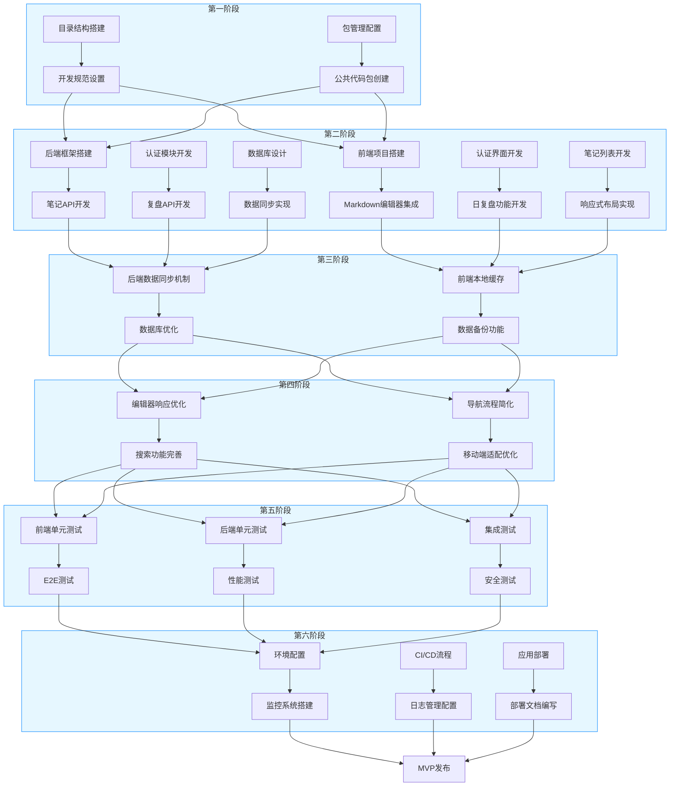

## 四、依赖关系图

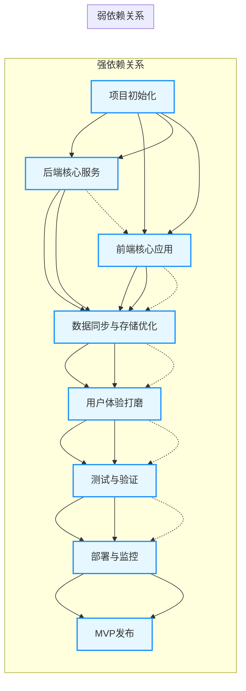

## 五、开发流程图使用说明

### 1. 查看方式
- 本文件使用Mermaid语法绘制流程图，可在支持Mermaid的Markdown编辑器中直接查看
- 推荐使用VS Code + Markdown Preview Mermaid Support插件查看
- 或直接在GitHub上查看（GitHub支持Mermaid渲染）

### 2. 图表说明
- **整体流程概览**：展示了从项目启动到MVP发布的完整流程，包括各子项目的顺序和并行关系
- **详细子项目流程图**：每个子项目的任务分解和执行顺序
- **项目时间线**：甘特图形式展示项目进度和时间安排
- **并行任务关系图**：展示各阶段内部的并行任务和依赖关系
- **依赖关系图**：清晰展示强依赖和弱依赖关系

### 3. 核心信息
- **并行开发**：T1和T2完全并行，可缩短开发周期
- **关键里程碑**：
  - T0完成：项目架构搭建完成
  - T1+T2完成：前后端核心功能开发完成
  - T3完成：数据同步与存储优化完成
  - T4完成：用户体验打磨完成
  - T5完成：测试与验证完成
  - T6完成：部署与监控完成
  - MVP发布：项目正式上线

### 4. 执行建议
- **团队协作**：根据智能体专长分配任务，确保每个子项目都有明确的负责人
- **每日同步**：每天进行15-30分钟的团队同步会议，确保进度一致
- **文档更新**：实时更新API文档和技术文档，确保团队信息同步
- **风险管控**：识别关键风险点，制定应急预案
- **质量保证**：建立严格的代码审查和测试流程，确保产品质量

通过这些可视化图表，团队可以更直观地了解项目开发流程，合理安排任务，确保项目按时高质量完成。